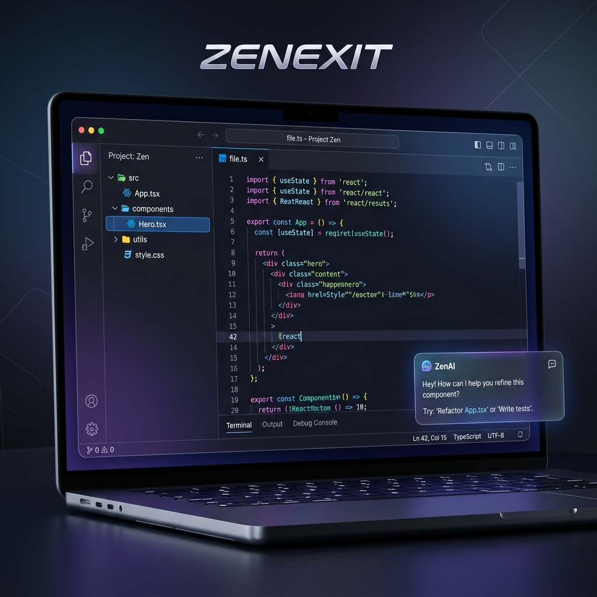

# ⚡ ZenExit IDE — The AI-Powered Zen Workspace

**ZenExit IDE** is a premium, high-performance web-based Integrated Development Environment (IDE) designed for modern developers who crave speed, intelligence, and a distraction-free "Zen" environment.



---

## 🚀 Key Features

### 🛠️ Boilerplate Engine
Start your projects in seconds. ZenExit features a built-in template engine providing professional boilerplates for **9+ programming languages**, including:
*   **Web**: HTML, CSS, JavaScript, TypeScript
*   **Systems**: Rust, Go, C++, Java
*   **Data/Scripting**: Python

### 🤖 ZenExit AI Assistant
A context-aware AI partner built directly into the workspace.
*   **Real-time Optimization**: Get code improvements as you type.
*   **One-Click Injection**: Seamlessly apply AI suggestions directly into your active file.
*   **Deep Debugging**: Understand errors and logic flaws with specialized insights.

### 💻 Robust Simulation Runtime
A fully integrated, bottom-docked terminal providing real-time execution feedback.
*   **Dynamic Resizing**: Drag-and-drop terminal interface for flexible layouts.
*   **Language Detection**: Automatic mapping of code to specialized output formats.
*   **Persistent Logs**: Clear, formatted logs with success/warning/error indicators.

### 🎨 Premium "Zen" UI
Designed for flow and focus.
*   **Glassmorphism**: A modern, translucent interface with subtle backdrop blurs.
*   **Command Palette (Ctrl+P)**: Instant file switching and global search.
*   **Responsive Resizing**: All panels (Sidebar, Editor, Chat, Terminal) are fully resizable and togglable.
*   **Dark/Light Mode**: Elegant themes optimized for long coding sessions.

---

## 🛠️ Tech Stack

*   **Frontend**: React 19, Vite 8
*   **Editor Engine**: Monaco Editor (The core of VS Code)
*   **State Management**: Zustand (Atomic state with LocalStorage persistence)
*   **Animations**: Framer Motion (Fluid transitions and micro-interactions)
*   **Styling**: Tailwind CSS (Utility-first design)
*   **Icons**: Lucide React
*   **Deployment**: Vercel (SPA-optimized)

---

## 🏗️ Installation & Setup

1. **Clone the repository**:
   ```bash
   git clone https://github.com/bhuvi-d/HackStreet--ZenExit-IDE.git
   cd HackStreet--ZenExit-IDE
   ```

2. **Install dependencies**:
   ```bash
   npm install
   ```

3. **Start the development server**:
   ```bash
   npm run dev
   ```

4. **Build for production**:
   ```bash
   npm run build
   ```

---

## 🌐 Vercel Deployment

ZenExit is optimized for Vercel. The included `vercel.json` ensures that Single Page Application (SPA) routing works perfectly across all sub-paths.

To deploy:
1. Push your code to GitHub.
2. Connect your repository to Vercel.
3. The build command `npm run build` and output directory `dist` will be detected automatically.

---

## 📝 License

This project is licensed under the MIT License - see the [LICENSE](LICENSE) file for details.

---

*Built with ❤️ for the HackStreet Hackathon.*
